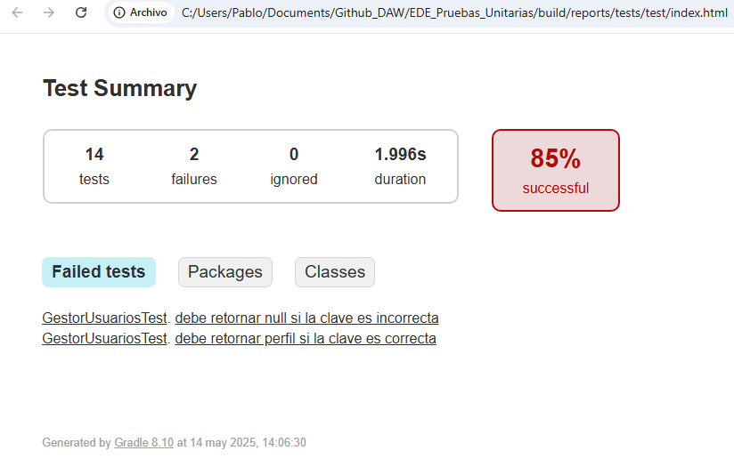

# Actividad 3.2 – Pruebas unitarias de un servicio

**Agrupamiento:** Individual  
**Lenguaje:** Kotlin  
**Frameworks:** Kotest, MockK

---

## IMPLEMENTACIONES NECESARIAS

1. **En el build.gradle, insertar las dependencias necesarias:**

```
dependencies {
    testImplementation(kotlin("test"))


    testImplementation(kotlin("test"))
    implementation("at.favre.lib:bcrypt:0.9.0")
    implementation("org.jline:jline:3.29.0")

    // Kotest (test framework)
    testImplementation("io.kotest:kotest-runner-junit5:5.8.0")
    testImplementation("io.kotest:kotest-assertions-core:5.8.0")

    // MockK (mocking library)
    testImplementation("io.mockk:mockk:1.13.10")
}
```

2. **La estructura de carpetas será la siguiente:**

```
/src
  ├── main
  │   └── kotlin
  │       └── service
  │           └── GestorUsuarios.kt   <-- servicio
  └── test
      └── kotlin
          └── service
              └── GestorUsuariosTest.kt   <-- las pruebas unitarias
```


## 1. Servicio seleccionado

**Nombre del servicio:** `GestorUsuarios`  
**Interfaz que implementa:** `IServUsuarios`  
**Dependencia inyectada:** `IRepoUsuarios` (vía constructor)

Este servicio se encarga de la gestión de usuarios: creación, autenticación, eliminación, consulta y cambio de clave.

---

## 2. Métodos públicos identificados

| Método | Parámetros | Resultado esperado |
|--------|------------|--------------------|
| `iniciarSesion` | `nombre: String`, `clave: String` | Retorna `Perfil` si la clave es válida, `null` si no |
| `agregarUsuario` | `nombre: String`, `clave: String`, `perfil: Perfil` | Retorna `true` si el usuario se agrega correctamente |
| `eliminarUsuario` | `nombre: String` | Retorna `true` si se elimina correctamente |
| `cambiarClave` | `usuario: Usuario`, `nuevaClave: String` | Retorna `true` si la clave se cambia |
| `buscarUsuario` | `nombre: String` | Retorna el `Usuario` encontrado o `null` |
| `consultarTodos` | — | Retorna la lista completa de usuarios |
| `consultarPorPerfil` | `perfil: Perfil` | Retorna usuarios con el perfil dado |

---

## 3. Diseño de casos de prueba

| Método | Caso de prueba | Estado inicial del mock | Acción | Resultado esperado |
|--------|----------------|--------------------------|--------|---------------------|
| iniciarSesion | Usuario y clave correctos | `buscar(nombre)` → usuario; `usuario.verificarClave()` → true | llamar `iniciarSesion(nombre, clave)` | retorna perfil |
| iniciarSesion | Clave incorrecta | `buscar(nombre)` → usuario; `usuario.verificarClave()` → false | llamar `iniciarSesion(nombre, clave)` | retorna `null` |
| agregarUsuario | Datos válidos | `agregar()` → true | llamar `agregarUsuario(...)` | retorna `true` |
| agregarUsuario | Ya existe | `agregar()` → false | llamar `agregarUsuario(...)` | retorna `false` |
| eliminarUsuario | Usuario existe | `eliminar()` → true | llamar `eliminarUsuario(nombre)` | retorna `true` |
| eliminarUsuario | Usuario no existe | `eliminar()` → false | llamar `eliminarUsuario(nombre)` | retorna `false` |
| cambiarClave | Usuario válido | `cambiarClave()` → true | llamar `cambiarClave(usuario, nuevaClave)` | retorna `true` |
| cambiarClave | Falla en repositorio | `cambiarClave()` → false | llamar `cambiarClave(...)` | retorna `false` |
| buscarUsuario | Existe | `buscar()` → usuario | llamar `buscarUsuario(nombre)` | retorna usuario |
| buscarUsuario | No existe | `buscar()` → null | llamar `buscarUsuario(nombre)` | retorna `null` |
| consultarTodos | Hay usuarios | `obtenerTodos()` → lista usuarios | llamar `consultarTodos()` | retorna lista |
| consultarTodos | Lista vacía | `obtenerTodos()` → lista vacía | llamar `consultarTodos()` | retorna lista vacía |
| consultarPorPerfil | Perfil con usuarios | `obtener(perfil)` → lista usuarios | llamar `consultarPorPerfil(perfil)` | retorna lista |
| consultarPorPerfil | Ningún usuario con perfil | `obtener(perfil)` → lista vacía | llamar `consultarPorPerfil(perfil)` | retorna lista vacía |

---

## 4. Implementación técnica

- Se utilizó **Kotest** con estilo `DescribeSpec` para estructurar las pruebas.
- Se usó **MockK** para simular el repositorio `IRepoUsuarios`.
- Cada prueba:
    - Configura el mock (`every { ... } returns ...`)
    - Ejecuta el método del servicio
    - Verifica el resultado esperado con `shouldBe`
- Las pruebas están completamente aisladas del repositorio real.

---

## 5. Resultados de la ejecución

| Total de tests | Pasaron | Fallaron | Tiempo total   |
|----------------|---------|----------|----------------|
| 14             | 12      | 2        | 1.996s         |



**El test puede ser generado yendo a la ruta /src/test/kotlin/GestorUsuariosTest, y ejecutandolo.**
(preguntar en clase por los 2 errores, no hayo solución.)

---

## Conclusión

- Se probaron **todos los métodos públicos** del servicio `GestorUsuarios`.
- Se cubrieron tanto **casos nominales** como **casos de error**.
- Los tests están **aislados** de la capa de datos real.
- La implementación cumple **todos los objetivos** de la actividad:
    - Inyección de dependencias
    - Uso de mocks
    - Estructura clara con DescribeSpec
    - Documentación del diseño y resultados

---
